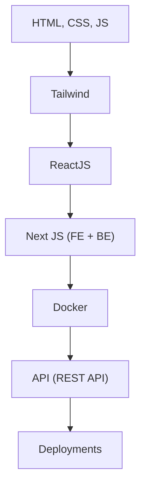

learn fullstack development

# Learn Fullstack Development

```mermaid
flowchart TD
    HTML["HTML, CSS, JS"] --> Tailwind
    Tailwind --> ReactJS
    ReactJS --> NextJS["Next JS (FE + BE)"]
    NextJS --> Docker
    Docker --> API["API (REST API)"]
    API --> Deployments
```

//need to fix mermaid config

//template aftermath study group