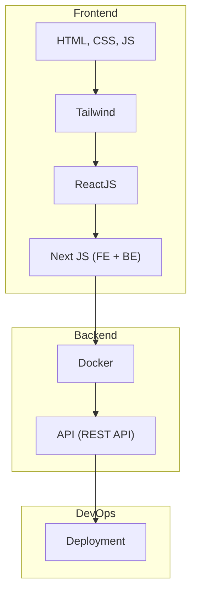

learn fullstack development

# Learn Fullstack Development

//need to fix mermaid config

//template aftermath study group

<!DOCTYPE html>
<html lang="en">
<head>
    <meta charset="UTF-8">
    <meta name="viewport" content="width=device-width, initial-scale=1.0">
    <title>Image Collage</title>
    
</head>
<body>
    <h1>In Memories</h1>
    

        
    

</body>
</html>